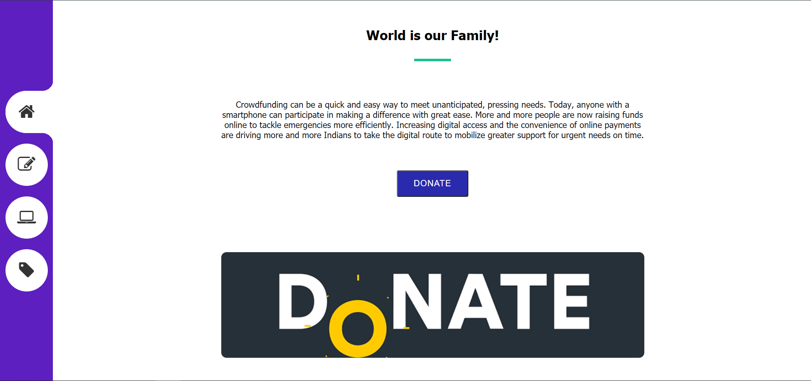
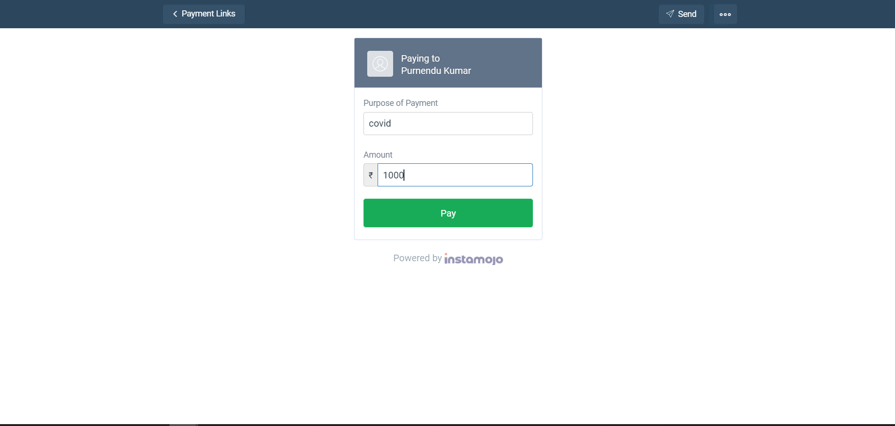
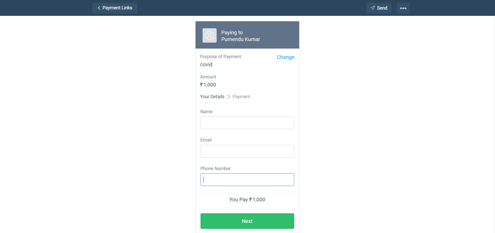
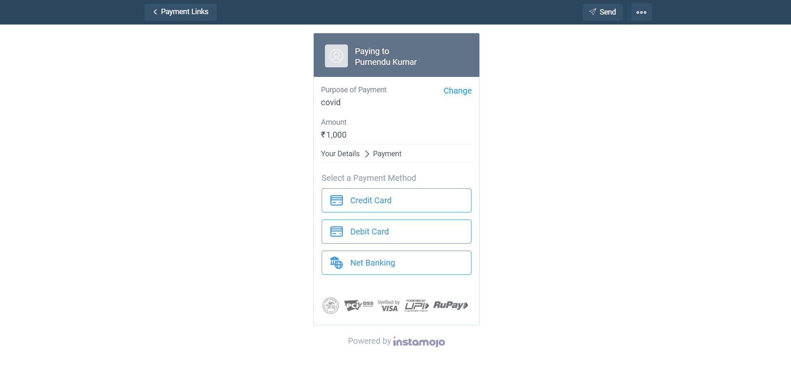
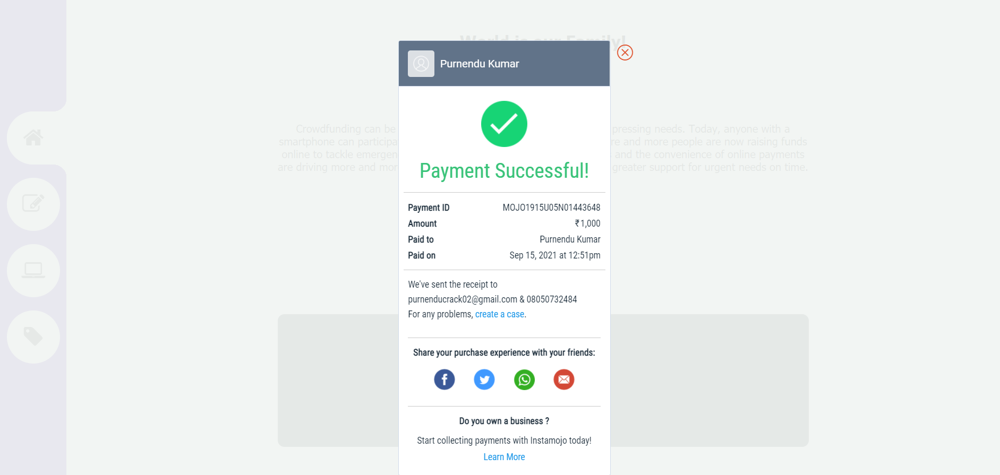
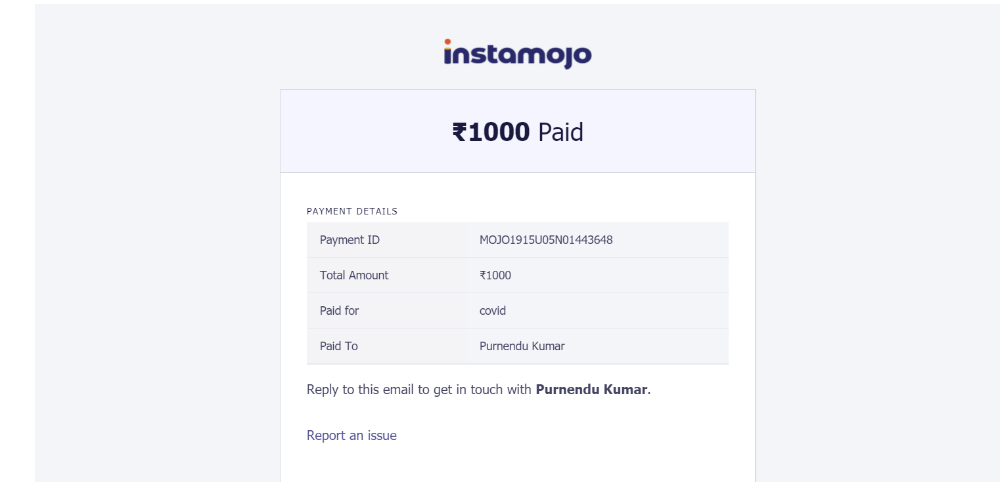

# Task: PAYMENT GATEWAY INTEGRATION
An internship project at The Sparks Foundation 
<ul>
 <li>I have added payment gateway using Instamojo.</li>
  <li>It supports payments using credit card, debit card and net banking.</li>
 <li>The payment gateway also sends an email and a receipt to receipient's email.</li>
</ul>
<h2>Website Link</h2>
 <a href="https://purnendu2201.github.io/DonationHub/">DonationHub</a>
  
  <h2>Video Link</h2>
 <a href="https://www.linkedin.com/posts/purnendu22_task3-gripseptember21-gripsept21-activity-6843840047611998208-acqV">Video Link</a>
  
  
  
<h2>Snapshots</h2>

